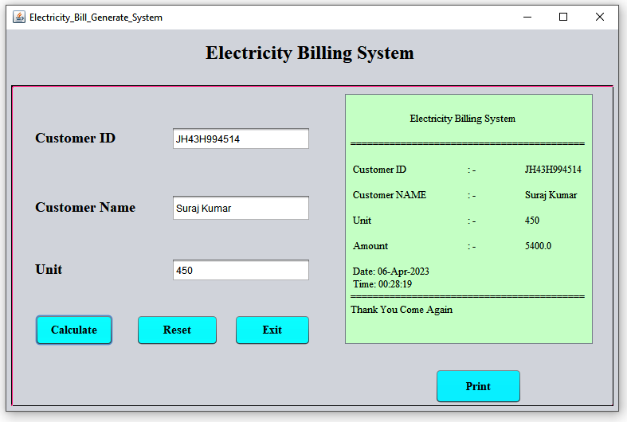

# Electric_Bil
This is our Electric bill generate system


Electricity Bill means the invoice sent every month to customers or consumers stating in detail all components, charges or rates that are part of the total
amount that every customer or consumer must pay for using electricity.
------------------------------------------------------------------------------------------------------------------------------------------------------------
Using java Swing in NetBeans IDE.
---------------------------------
# Project Documentation
<p align="center">
  <a href="" rel="suraj">
 </a>
</p>


<h3 align="center">Electricty Bill Generate Syatem</h3>

---

<p align="center"> The purpose of the Electricity Billing System is to automate the existing manual system 
with the help of computerized equipment and fullfledged computer software, fulfilling 
their requirements, so that their valuable data/information can be stored for a long period
with easy access and manipulation of the same. 
The required software and hardware are easily available and easy to work with. 
Electricity Billing System, as described above, can lead to an errorfree, secure, reliable 
and fast management system.
    <br> 
</p>

## 📝 Table of Contents
- [Abstract](#abstract)
- [Introduction](#introduction)
- [Getting Started](#getting_started)
- [Steps to Develop a EBS using Java GUI](#steps_to_develop_a_ebs_using_java_gui)
- [Electricty Billing System Usage](#usage)
- [Flow Chart](#flowchart)
- [TODO](../TODO.md)
- [Contributing](../CONTRIBUTING.md)
- [Author](#author)
- [Acknowledgments](#acknowledgement)

## 🧐 Abstract <a name = "abstract"></a>
The purpose of Electricity Billing System is to automate the existing manual system by 
the help of computerized equipments and full-fledged computer software, fulfilling their 
requirements, so that their valuable data/information can be stored for a longer period 
with easy accessing and manipulation of the same. 

The required software and hardware 
are easily available and easy to work with.
Electricity Billing System, as described above, can lead to error free, secure, reliable and
fast management system. 

It can assist the user to concentrate on their other activities 
rather to concentrate on the record keeping. Thus it will help organization in better 
utilization of resources. The organization can maintain computerized records without 
redundant entries. That means that one need not be distracted by information that is not 
relevant, while being able to reach the information.


The aim is to automate its existing manual system by the help of computerized 
equipments and full-fledged computer software, fulfilling their requirements, so that 
their valuable data/information can be stored for a longer period with easy accessing and
manipulation the same. Basically, the project describes how to manage for good 
performance and better services for the clients. 


## Introduction <a name = "introduction"></a>
The "Electricity Billing System" has been developed to override the problems prevailing
in the practicing manual system. This software is supported to eliminate and in some 
cases reduce the hardships faced by this existing system. Moreover this system is 
designed for the particular need of the company to carry out operations in a smooth and 
effective manner.


The application is reduced as much as possible to avoid errors while entering the data. It 
also provides error message while entering invalid data. No formal knowledge is needed 
for the user to use this system. Thus by this all it proves it is user-friendly. Electricity 
Billing System, as described above, can lead to error free, secure, reliable and fast 
management system. It can assist the user to concentrate on their other activities rather 
to concentrate on the record keeping. Thus it will help organization in better utilization 
of resources


## 🏁 Getting Started <a name = "getting_started"></a>
These instructions will get you to develop the Electricity Billing System project in java using (GUI) Graphical User Interface, Java Swing and Java awt. 

[Steps to Develop a EBS usng Java GUI](#steps_to_develop_a_ebs_using_java_gui) 

1.NetBeans Installation

2.Create a Project File in beans

3.Drag and Drop GUI'S

4.Button Configuration

### NetBeans Installation
NetBeans IDE is a Free open-Source, Cross-plate form Integrated Development 
Environment (IDE) with built-in support for the JAVA Programming Language. It can 
run any machine which consists of the Java Virtual Machine (JVM). It consists of many 
features for application development as follows:

•Drag & Drop Graphical User Interface (GUI) Creation.

•Excellent editing (advanced source code editor)

•Web-service

•Excellent debugging

•Wizards, code generation and management tools, and many more.

Step 1: You need to have a setup file of the NetBeans JAVA into your setup.

Step 2: If you didn’t have the setup you can download from the following link:

```
https://netbeans.org/images_www/v6/download/community/8.2
```

step 3: You can download any type of setup as per your requirements from the above
mentionwebpage.

Step 4. Right-click on the setup or you can Double-Click on the setup by using the
mouse.

Step 5.Click on the next option


### Create a Project File in beans
Launch the NetBeans IDE

1. In the NetBeans IDE, 

Click
```
File--New Project--Java--Java Application.
```

2. After creating the project go to the source package richt click new and select the JFrame

Example:

```
Source Package--New--JFrame
```

3. In the Name and Location page of the wizard, do the following

4. Click Finish

### DRAG and DROP GUI'S

In the Projects window, right-click the DragAndDropSample project, 

choose New > 


File/Folder. In the New File wizard, under Categories, select NetBeans Module 
Development. Under File Types, select Window Component. Click Next.


## Running the Project File <a name = "run"></a>
After completing the project select the file right click it and choose Run. 

After that the application will open we can do bill calculationg parts in the new opened window.

we can able to print the bill as three formats

1. Fax

2. word document

3. PDF file.

Its better we choose the file as in PDF format.

## Electricty Billing System Usage <a name="usage"></a>
It has three major features.

1. Text field:-
In this project there are three main text field. In first one is Customer Id in which we 
have to fill Customer Id in second one is for Customer Name in this we have to fill 
customer Name and in the third one is for Unit which is consumed by the customer

2. Cal Button:-
Cal Button calculate the gross amount of the unit which consumed by the customer and 
using lava code it calculate the total bill amount. In this project for different- different 
unit range there is different rate of charge according to our given data

3. Print Button:-
In print button it print the all detailed which was shown by the cal button like Customer 
Id, Customer Name Unit, and Amount etc

## Deployment <a name = "deployment"></a>

First Run the file next we get a GUI for calculate the bills and print.


## ⛏️ Flow Chart <a name = "flowchart"></a>


## ✍️ Author <a name = "author"></a>
- [@Skill-Lync](https://github.com/Suraj138) Suraj Kumar

## 🎉 Acknowledgements <a name = "acknowledgement"></a>
- Inspiration

    Self learning and gain new skill.    (',')

